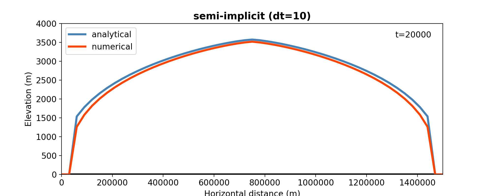
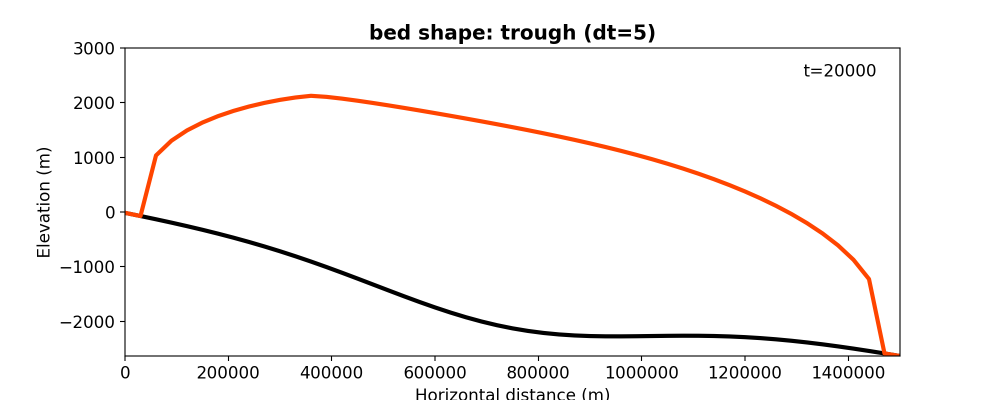

# Modelling Sandbox

### Overview
This repository contains Python code examples of simple SIA-based ice sheet models aimed to serve as an introduction to numerical ice-sheet modelling and as a playground.

### Contents
- [`introduction_to_numerical_ice_sheet_modelling.ipynb`](introduction_to_numerical_ice_sheet_modelling.ipynb): Contains examples for simple diffusion and advection models (FTCS) as well as a simple ice-sheet model based on the Shallow Ice Approximation (SIA).

- ...

### Requirements & dependencies
The code is written in [Python 3](https://www.python.org). To run it you need [NumPy](https://numpy.org) to be installed, as well as [Matplotlib](https://matplotlib.org) for plotting, and the Python `time` module for some statistics.

The [Jupyter](https://jupyter.org) notebook format (`.ipynb`) containes all code and figures along with the underlying mathematical equations and some text. If you haven't used this before, you may have a look [here](https://jupyter.readthedocs.io/en/latest/install.html).

### Gallery

### Author
[Julius Garbe](mailto:julius.garbe@pik-potsdam.de), Potsdam Institute for Climate Impact Research

### License
The contents of this repository are licensed under the Creative Commons Attribution 4.0 International ([CC BY 4.0](https://creativecommons.org/licenses/by/4.0/)) license. See [LICENSE.txt](LICENSE.txt).
